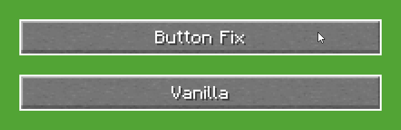

# Button Fix ([MC-259387](https://bugs.mojang.com/browse/MC-259387))

A small client-side mod that fixes widget focus issues in any in-game GUI.  
These issues affect all Minecraft versions since 1.19.4.

In Vanilla, GUI buttons and sliders remain focused after a mouse click until another widget claims focus. This can be visually distracting - especially when using resource packs that change the appearance of GUI widgets.  
*Button Fix* resolves this issue by properly resetting the focus after interaction.

This fix applies to all sliders and pressable widgets in in-game GUIs — for example, the recipe book button in the inventory screen, or the buttons and sliders in the main menu, pause menu, or mod config screens — as long as they use vanilla widget implementations.